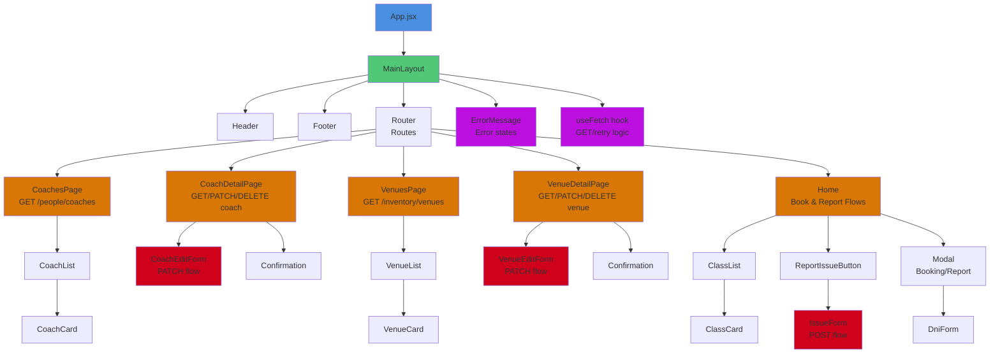

# Phase 3 Component Hierarchy Map

## Visual Hierarchy

**Color Legend:**
- **Blue**: Root component (App)
- **Green**: Layout wrapper (MainLayout)
- **Orange**: Page components (read/detail flows)
- **Red**: Mutation forms (PATCH/DELETE/POST)
- **Purple**: Shared utilities (error handling, fetch hooks)

## Route and layout structure

- `App`
  - Wraps the application in `BrowserRouter`.
  - Renders shared chrome and route definitions.
- `Header`
  - Global navigation with links to `Home`, `Coaches`, and `Venues`.
- `Footer`
  - Shared footer displayed on every route.
- Routes
  - `/` -> `MainLayout`
  - `/coaches` -> `CoachesPage`
  - `/coaches/:publicId` -> `CoachDetailPage`
  - `/venues` -> `VenuesPage`
  - `/venues/:publicId` -> `VenueDetailPage`

## Home flow components

- `MainLayout`
  - Owns the local Phase 1 booking/reporting workflow.
  - Manages local state for classes, booking modal, reporting flow, confirmation messaging, and issue records.
  - Uses `requestApi()` for POST attempts when the Phase 3 backend contract is available, with local fallback behavior.
  - Passes handlers and loading flags down to the modal forms.
- `ClassList`
  - Receives `classes` and `onBook`.
  - Renders the list of class cards.
- `ClassCard`
  - Receives a single class item and an `onBook` callback.
  - Triggers the booking flow for one class.
- `ReportIssueButton`
  - Opens the issue-report flow.
- `Modal`
  - Shared dialog wrapper for booking, DNI verification, issue submission, and confirmation.
- `DniForm`
  - Controlled form for DNI entry.
  - Receives `onSubmit`, `onBack`, `error`, `isSubmitting`, and `submitLabel`.
- `IssueForm`
  - Controlled issue submission form.
  - Receives `onSubmit`, `initialZone`, `initialType`, `isSubmitting`, and `submitLabel`.
- `Confirmation`
  - Displays success feedback after booking or issue creation.

## Coaches feature components

- `CoachesPage`
  - Fetches coaches with `useFetch('/people/coaches')`.
  - Owns loading, error, and retry rendering for the list view.
- `CoachList`
  - Normalizes list-shaped API responses.
  - Receives `coachesData` and renders a list of `CoachCard` components.
- `CoachCard`
  - Receives one coach object.
  - Links to the coach detail route via `publicId`.
- `CoachDetailPage`
  - Fetches one coach with `useFetch('/people/coaches/:publicId')`.
  - Uses `refetch` for retry after errors.
  - Owns edit mode state and toggles between view and edit UI.
  - Renders a detail card with normalized fields and raw debug data.
- `CoachEditForm`
  - Controlled form for coach profile editing (first name, last name, email, phone, date of birth, address public ID, certification).
  - Receives `coach`, `onSubmit`, `onCancel`, `error`, `isSubmitting`.
  - Performs client-side validation before submission.
  - Sends PATCH request to `/people/coaches/:publicId`.

## Venues feature components

- `VenuesPage`
  - Fetches venues with `useFetch('/inventory/venues')`.
  - Owns loading, error, and retry rendering for the list view.
- `VenueList`
  - Normalizes list-shaped API responses.
  - Receives `venuesData` and renders venue cards with detail links.
- `VenueDetailPage`
  - Fetches one venue with `useFetch('/inventory/venues/:publicId')`.
  - Uses `refetch` for retry after errors.
  - Owns edit mode state, delete confirmation state, and handlers.
  - Renders a detail card with normalized fields and raw debug data.
  - Renders `VenueEditForm` for updating venue fields.
- `VenueNotesList`
  - Not used by the current backend-aligned story set.

## Shared data and utility layers

- `useFetch(path)`
  - Handles read requests, loading state, error state, retry ticks, and a reusable `request()` helper.
  - Exposes `requestApi()` for mutation calls that need a path plus HTTP method/body.
- `config.js`
  - Builds API URLs from `VITE_API_BASE_URL`.
- Data files used by the temporary local flows
  - `classes.json`
  - `issues.json`
  - Method: `POST` to `/classes/bookings`
  - Outcome: local booking state update, confirmation modal, optional API response
- Issue flow
  - Trigger: `ReportIssueButton` -> `MainLayout`
  - Input: `DniForm` -> `IssueForm`
  - Method: `POST` to `/issues`
  - Outcome: local issue creation, confirmation modal, optional API response
- Coach profile update flow
  - Trigger: `CoachDetailPage` "Edit Profile" button
  - Input: `CoachEditForm` (first name, last name, email, phone, date of birth, address public ID, certification)
  - Method: `PATCH` to `/people/coaches/:publicId`
  - Outcome: refetch coach data, confirmation feedback, return to view mode
- Venue deletion flow
  - Trigger: `VenueDetailPage` "Delete Venue" button
  - Input: confirmation dialog + venue public ID
  - Method: `DELETE` to `/inventory/venues/:publicId`
  - Outcome: navigate back to venue list, confirmation feedback
- Feedback components
  - Loading: page-level text in `CoachesPage`, `VenuesPage`, `CoachDetailPage`, `VenueDetailPage`
  - Success: `Confirmation` for booking/issue creation
  All six user stories are now represented in the component hierarchy.
- HTTP verb coverage: `GET` (Stories 3, 4), `POST` (Stories 1, 2), `PATCH` (Story 5), `DELETE` (Story 6).
- Authentication/authorization is handled via DNI validation with role-based access (admin/staff/member roles stored in validDnis.json).
- Inline editing for coaches provides a smooth user experience without navigation.
- Venue deletion includes confirmation prompts to prevent accidental data loss.
- All mutation flows include loading, success, and error states.
- The component structure remains modular and reusable, with clear separation between presentation and log
  - Input: `DniForm` -> `IssueForm`
  - Outcome: local issue creation, confirmation modal, optional POST attempt through `requestApi()`
- Feedback components
  - Loading: page-level text in `CoachesPage`, `VenuesPage`, `CoachDetailPage`, `VenueDetailPage`
  - Success: `Confirmation`
  - Error: `ErrorMessage`
  - Pending state: submit button disabling in `DniForm` and `IssueForm`

## Notes for Phase 3

- The current home flow is still backed by local JSON for compatibility, but its structure is ready for full mutation endpoints.
- The read-only pages already use the shared fetch hook and can be extended with update/delete actions later.
- This map should stay aligned with the Phase 3 deliverables and the six-story rubric.